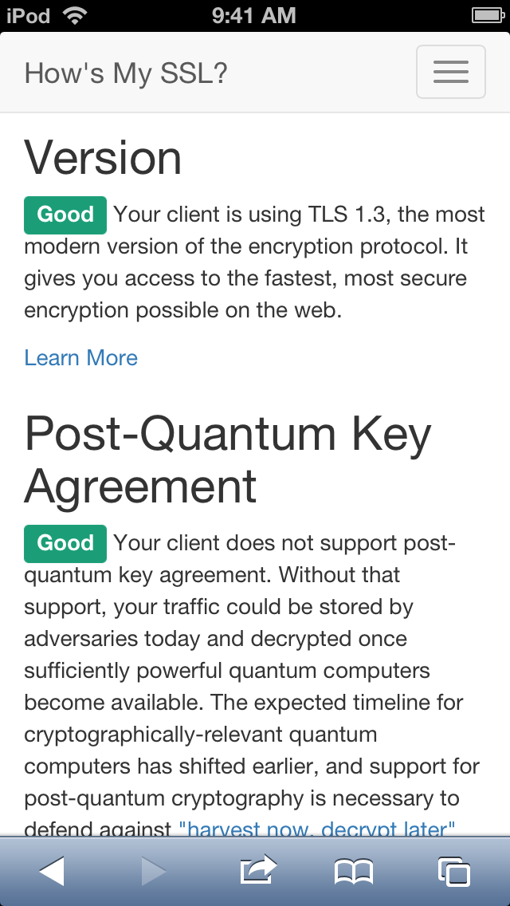

# TLSFix

Modern HTTPS for legacy iPhone, iPad, and iPod touch running iOS 3 to iOS 9.



Old versions of iOS can no longer open most of today's websites. The secure part of HTTPS
(the "S") relies on TLS, and the TLS built into old iOS is simply too old: it doesn't speak
modern ciphers, modern key exchanges, or modern certificates. So Safari and many apps just
spin forever or show a "cannot connect / not secure" error on sites that work fine everywhere else.

TLSFix fixes that. It reroutes the device's HTTPS through a fresh, bundled copy of the
mbedTLS library, so your old iPhone or iPad can reach modern servers again: TLS 1.2 and TLS 1.3,
modern ciphers (ChaCha20-Poly1305, AES-GCM), and modern certificates (the same ones Let's Encrypt
and friends use today). Certificates are properly verified against an up-to-date trust list, so
this restores security, it doesn't disable it.

It works across a wide range of iOS versions (iOS 3 to 9) and every CPU type
those devices used (armv6, armv7, arm64), all in one package. Confirmed on real devices running
iOS 3.2.2, 5.1.1, 6.1.3, 6.1.4, 7.1.2, 8.4.1, and 9.3.5: Safari now loads modern HTTPS sites over
full TLS 1.3.

## Install

### A. From the Cydia repo (easiest)

1. Open [tlsroot.litten.ca](https://tlsroot.litten.ca/) in Safari and install the iOS certificate bundle.
2. Add this source in Cydia:

   ```
   https://nfzerox.github.io/cydia/
   ```
3. Search for TLSFix and install it.

That's it. TLSFix is enabled for Safari by default. To enable it for other apps, see
[Usage](#usage) below.

### B. From a downloaded deb file

Handy if the repo is unreachable, if you are on a very old iOS, or if you just prefer files.

1. Download the package on any computer:
   [tlsfix_1.0.0_iphoneos-arm.deb](https://github.com/nfzerox/TLSFix/raw/main/tlsfix_1.0.0_iphoneos-arm.deb).
2. Copy it onto the device over USB with a desktop file tool such as iMazing, iFunbox,
   3uTools, or iTools.
3. Install it, either way:
   * If you have a file manager app on the device (Filza, or iFile on older setups):
     copy the `.deb` somewhere you can browse to (for example `/var/mobile/Media/`), open it,
     tap Install, then Respring.
   * If you don't have a file manager app: put the `.deb` into Cydia's auto-install folder:

     ```
     /var/root/Media/Cydia/AutoInstall/
     ```

     This folder is on the regular "Media" storage that iMazing / iFunbox / 3uTools can write to
     directly over USB (no SSH, no extra apps). Create the folder if it isn't there, drop the file
     in, then reboot. Cydia installs anything in that folder on boot and then clears it.

If you happen to have a terminal on the device, you can also just run
`dpkg -i tlsfix_1.0.0_iphoneos-arm.deb` and `killall -HUP SpringBoard`.

### C. Build it yourself

`git clone https://github.com/nfzerox/TLSFix` and follow [Building from source](#building-from-source).

## Usage

Safari works right away without setup.

To turn TLSFix on for other apps, open Settings › TLSFix and flip on the apps you want.
The Settings panel needs PreferenceLoader and AppList installed. If
Settings › TLSFix is missing or its app list is empty, install those two and respring. If you'd
rather not, you can enable apps by editing a file instead (see
[Enabling apps by hand](#enabling-apps-by-hand)).

A few notes:

* Changes take effect after you force-quit and relaunch the app.
* On iOS 8 and later, Safari and in-app web views run through shared system WebKit processes rather
  than the app itself. TLSFix turns those on by default (they show up as the WebKit Networking and
  WebKit Content switches in the Settings pane), so the web just works with no extra setup.
* Leave Apple's own system apps and anything that does banking-grade certificate pinning off. TLSFix
  is meant for browsers and regular apps.
* If the Settings panel doesn't show up on your iOS, you can still enable apps by hand (below).

If a site still won't load, it is usually one that needs an even newer connection than the device's
networking stack can route; this is rare for normal websites.

### Enabling apps by hand

On most iOS versions there's a graphical picker: open Settings and look for TLSFix Apps, a
list of your apps with a switch each. If you don't see it, install AppList and PreferenceLoader
from Cydia.

If that picker isn't available on your iOS, or you'd rather not use it, edit the plist file:
`/var/mobile/Library/Preferences/com.tlsfix.plist`. Add an `enabled-<bundle id>` key
per app you want on:

```xml
<?xml version="1.0" encoding="UTF-8"?>
<!DOCTYPE plist PUBLIC "-//Apple//DTD PLIST 1.0//EN" "http://www.apple.com/DTDs/PropertyList-1.0.dtd">
<plist version="1.0"><dict>
  <key>enabled-com.apple.mobilesafari</key><true/>
  <key>enabled-com.apple.WebKit.Networking</key><true/>  <!-- iOS 8+ Safari / in-app web (on by default) -->
  <key>enabled-com.yourcorp.someapp</key><true/>   <!-- add more apps here -->
  <key>tls13</key><true/>                            <!-- options below, all on by default -->
  <key>drainGuard</key><true/>
  <key>systemFallback</key><true/>
</dict></plist>
```

Relaunch the app afterward (or respring). The file is read once when the app starts, so changes need
an app relaunch.

The three options at the bottom are global and on by default:

* `tls13`: allow TLS 1.3 (turn off to cap at TLS 1.2).
* `drainGuard`: a safety limit on TLS 1.3 post-handshake processing.
* `systemFallback`: if a modern handshake fails, let that host's next connection fall back to the
  device's own (older) TLS.

SpringBoard is always left alone, so enabling "every app" is safe.

### Keeping certificates current

TLSFix checks that sites are genuine against a bundled list of trusted certificate authorities, kept
at `/Library/MobileSubstrate/DynamicLibraries/tlsfix-cacert.pem`. That list is a snapshot from when
the package was built, so after a few years a site using a newer authority could fail to verify. To
refresh it, download the latest CA bundle from <https://curl.se/ca/cacert.pem> (the Mozilla list,
maintained by the curl project), copy it onto the device replacing the file above (keep the
`tlsfix-cacert.pem` name), and respring.

---

# How it works (technical)

iOS's TLS engine is Secure Transport, exposed as a C API (`SSL*` functions). TLSFix injects a small
dylib that keeps the real `SSLContextRef` (so any `SSL*` call it doesn't intercept still operates
on a valid object and can't crash) and attaches an mbedTLS "shadow" keyed by that context pointer.
The shadow does the real handshake, encryption, and decryption. CFNetwork keeps driving the actual
network socket through the `SSLReadFunc` / `SSLWriteFunc` it already installed, which TLSFix bridges
into mbedTLS as a custom BIO. The peer trust object that `SSLCopyPeerTrust` returns is rebuilt from
the certificate mbedTLS actually saw, so the system's `SecTrustEvaluate` runs against the real chain.

It ships as one fat dylib covering iOS 3 to 9: `armv6` (oldest 32-bit devices), `armv7`
(min 3.0), and `arm64` (min 7.0). On-device-verified on iOS 3.2.2, 5.1.1, 6.1.3, 6.1.4, 7.1.2 (arm64),
8.4.1, and 9.3.5. iOS 9 is the top of the supported range: newer versions increasingly speak modern
TLS on their own.

## What it intercepts

TLSFix hooks only the Secure Transport entry points that move data or report identity: the calls
that wire up a connection, run the handshake, read and write, report session state and the
negotiated protocol and cipher, and hand back the peer's certificate chain and trust object. It also
covers the older, deprecated spellings of those trust and query calls that early iOS used, plus the
trust-evaluation call the system makes after a handshake. Each hook is installed only if the symbol
actually exists on the running OS, so functions that were renamed or removed are simply skipped.

Coverage was checked against the real Security stubs from the iOS 3.0 through 9.3.5 SDKs, and the SSL*
symbols TLSFix relies on are present and stable across the whole iOS 3 to 9 range. Everything else
(cipher and protocol configuration, session resumption, and internal entry points) is deliberately
untouched and keeps operating on the still-valid real context. No data-path or trust-path call is
left unhooked.

## Building from source

Prerequisites (not bundled, install these first):

* theos at `$HOME/theos` (or set `$THEOS`). Provides the compile SDK (`sdks/iPhoneOS9.3.sdk`),
  the Preferences headers for the Settings panel (`vendor/include`), and the deb builder (`bin/dm.pl`).
* Xcode command-line tools (`xcrun`, `clang`, `lipo`, `otool`, `install_name_tool`).
* ldid (fake-signing) and python3 (the minimum-version patcher).
* The first run of `build-mbedtls.sh` also needs git and a network connection (it clones mbedTLS once).

Everything else is vendored in the repo under `src/`: all source (`Tweak.m`, `ms_time_ios.c`,
`prefsbundle/`, `tools/`), the prebuilt mbedTLS static libraries (`lib/libmbed-{armv6,armv7,arm64}.a`),
the mbedTLS headers (`include/`), `cacert.pem`, and the package metadata; the built `.deb` lands at the
repo root. A fresh clone can run `src/build.sh` and `src/build-deb.sh` without re-cloning mbedTLS.

Scripts:

* `src/build-mbedtls.sh` rebuilds the mbedTLS libraries. It loops over `$TLSFIX_ARCHS` (default
  `armv7 arm64 armv6`), cross-compiling all of mbedTLS 3.6.0 per arch into `lib/libmbed-<arch>.a` and
  syncing headers to `include/`. Old-iOS fixes: `MBEDTLS_PLATFORM_MS_TIME_ALT` plus `ms_time_ios.c`
  (no `clock_gettime`), and `-D_FORTIFY_SOURCE=0` (the SDK's `memcpy` macro clashes with mbedTLS).
* `src/build.sh` links each arch against `lib/libmbed-<arch>.a`, then `lipo`s the slices into the fat
  `tlsfix.dylib` and patches `LC_VERSION_MIN_IPHONEOS` down (`tools/patch_iphoneos_min.py`), since the
  modern linker won't emit an iOS minimum below about 6.0. `MSHookFunction` resolves at runtime.
* `src/build-prefs.sh` builds the `TLSFix.bundle` Settings panel (needs theos `vendor/include`).
* `src/build-deb.sh` runs the above and packages `tlsfix_*.deb`. The only hard dependency is
  `mobilesubstrate`; PreferenceLoader and AppList are Recommends (they only power the Settings panel
  and don't exist on iOS 3–4), so the package installs cleanly even there. The postinstall script
  seeds Safari-on plus the default options.

## Status

* [x] Modern handshake (TLS 1.2 and 1.3, ECDHE, ChaCha20 / AES-GCM) in Safari.
* [x] SNI captured reliably (the shadow is created by whichever setter runs first, with late-SNI re-init).
* [x] Real verification: mbedTLS requires a valid chain and hostname against the bundled Mozilla
  `cacert.pem`; the system's `SecTrustEvaluate` is rubber-stamped only for connections already verified.
* [x] Clean lifecycle: the shadow is freed on `SSLDisposeContext` and LRU-evicted (256-slot table),
  so there's no leak and no per-process connection cap.
* [x] Robustness for non-browser apps: `SSLCopyPeerCertificates` returns mbedTLS's real chain;
  `SSLSetCertificate` (client certificate / mutual TLS) bypasses to the system's own TLS, because the
  private key can't be exported into mbedTLS; the trust object retains its members so there are no
  freed-pointer false positives.

## Deliberately not handled

* Mutual TLS / client certificates (push, iCloud, MDM): bypassed to the system's TLS, never broken.
* Private certificate authorities not in the Mozilla bundle: would fail verification, so they're
  excluded by the app filter.
* Apps that do their own custom certificate handling (`kSSLSessionOptionBreakOnServerAuth`): not
  modeled, so leave them off.
* Session resumption (`SSLSetPeerID`): not implemented (a full handshake each time, only slower).
* `cacert.pem` is static; refresh it periodically.

## License

TLSFix is released under the [MIT License](LICENSE). The external Mbed TLS (`src/include/`, `src/lib/`) is
licensed separately under Apache-2.0 by its authors.
